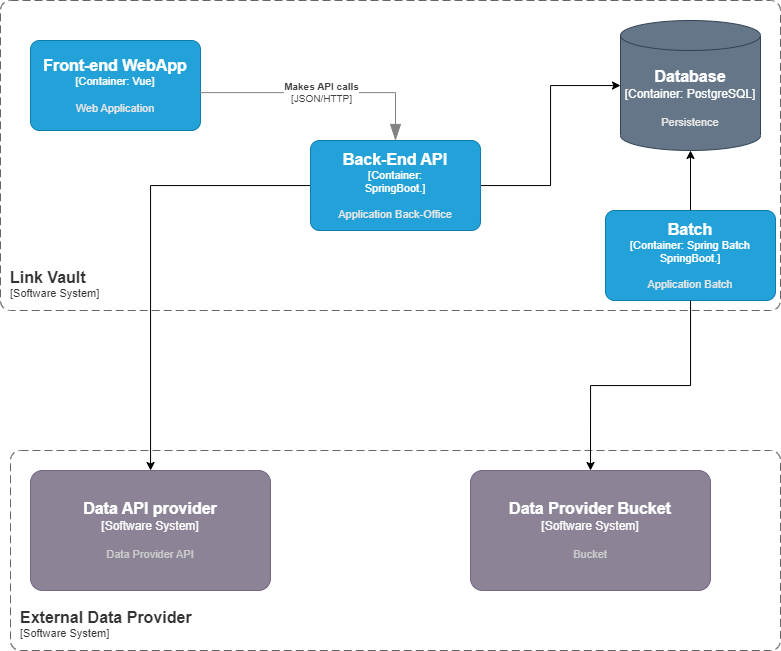

# Overall architecture

The overall architecture of the system is shown in the figure below. The system is divided into three main parts: the *
**Web App**, the **API** and the **Batch**.

## Architecture diagram

The architecture of our application is the following:

- The Web Application is the part that the user interacts with.
- The API is the part that handles the requests from the Web Application and communicates with the Database.
- The Batch is the part that treats data from files stored in buckets and stores the results in the Database.

## Future changes

There may be changes in the architecture in the future. so we'll try to make it as flexible as possible.

