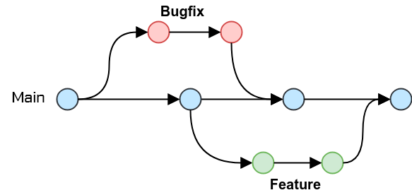

# Git workflow

## Context

Our organization is adopting GitHub Flow as the preferred workflow for managing software development projects on the
GitHub platform. GitHub Flow is a lightweight, branch-based workflow that facilitates collaboration and continuous
delivery. This ADR documents key decisions related to the usage of GitHub Flow within our development processes.

## Decision

After careful evaluation and consideration, we have decided to adopt the GitHub Flow as our primary workflow for
managing code repositories on GitHub.
GitHub Flow is a lightweight, branch-based workflow designed for teams that value simplicity and rapid delivery

## Consequences

The decision to adopt GitHub Flow has several implications for our development practices:

1. **Branching Model:**
    - Developers are expected to create feature branches for each task, bug fix, or enhancement.
    - Feature branches should be short-lived, with regular integrations into the main branch.

2. **Pull Request Guidelines:**
    - Pull requests must adhere to established guidelines, including clear descriptions, tests, and documentation.
    - Code reviews are mandatory before merging, ensuring code quality and knowledge sharing.

3. **Release Management:**
    - GitHub Flow guides our approach to versioning, tagging, and releasing software.
    - Releases will be marked by merging the main branch into a production branch.